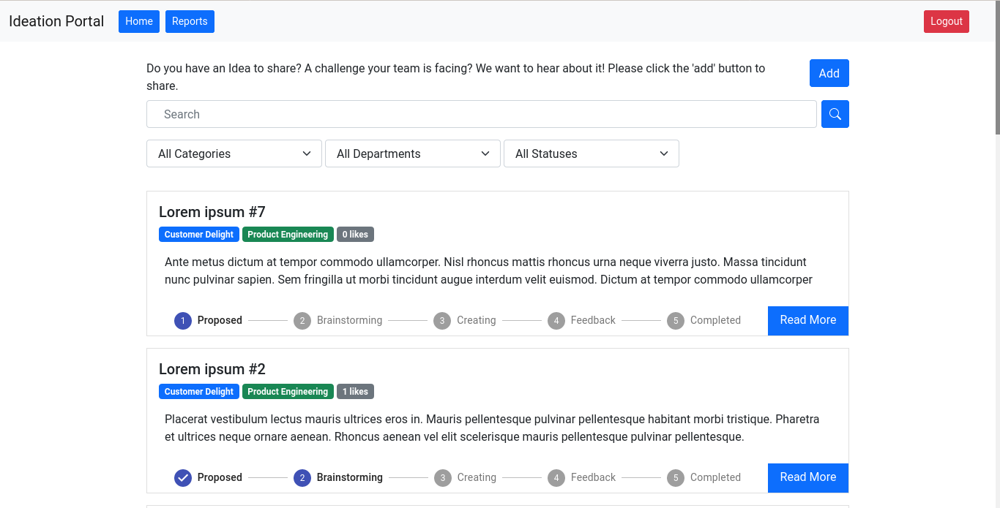
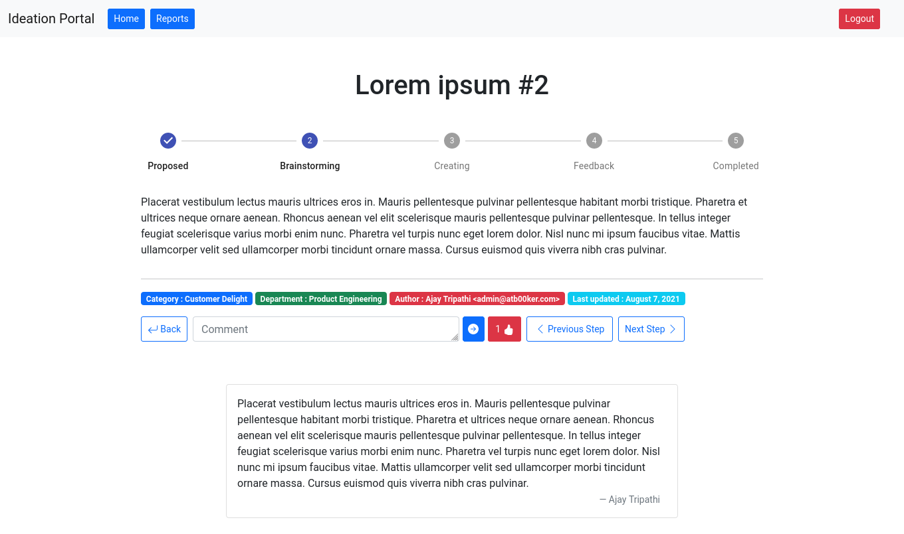
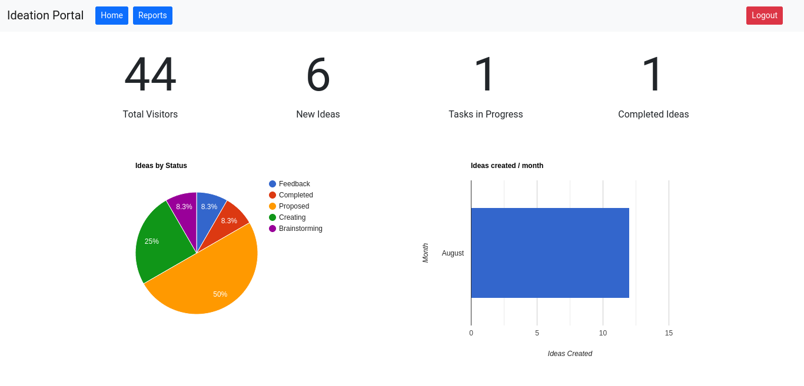

# Ideation Portal

Ideation portal for companies to create a repository of ideas.

## Pre-requisites

- nodejs
- npm | yarn
- docker
- docker-compose

## Features

The applcation contains contains a lot of basic useful features:

1. Authentication: auth is written in a plug-and-play (dependency injection) manner and you can simply switch to the authentication system you desire. For reference, please checkout [auth0 authentication implementation](src/views/components/Auth/Auth0.tsx) and implement all these functions in your prefered auth provider and [plug your custom file in AuthProvider file](src/views/components/Auth/AuthProvider.tsx).

2. Search / Filter: You of the box, you get the search and filter functionality on the home page, besides that, you can see the `Add` Idea button and the list of ideas below the filters which contain some meta data of the ideas and `Read More` button to checkout the details of the idea.
   

3. Comments & Likes: You can like and comment on the ideas as well to find out ideas that most people like and want to contribute towards.
   

4. We also have a reports functionality, you can very easily add your own graphs but out of the box, you get ideas created per month, ideas by department, category & status.
   

## Deployment

- Rename `.env.example` to `.env` and update configurations as per requirement.
  - You can get the value for `HASURA_GRAPHQL_JWT_SECRET` [hasura.io/jwt-config tool](https://hasura.io/jwt-config/).
  - `AUTH0_DOMAIN` and `AUTH0_CLIENT_ID` can be found in your auth0 account.
  - Ensure you are keeping a secure `HASURA_GRAPHQL_ADMIN_SECRET`.
- Start application using `docker-compose up -d`.

**Note:** If you are deploying to Hasura Cloud, remember to change the value of `from_env` in [`databases.yaml`](src/models/metadata/databases/databases.yaml) from `HASURA_GRAPHQL_METADATA_DATABASE_URL` to `HEROKU_DATABASE_URL` (or whatever your environment variable name is on the cloud) because `HASURA_GRAPHQL_METADATA_DATABASE_URL` wouldn't work.

## Development

- Install dependencies: `npm install --include=dev`
- Rename `.env.example` to `.env` and update configurations as per requirement. (Read deploy section for information about some variables)
- Start graphql-engine & database: `docker-compose up -d`
- Apply metadata to hasura: `npm run metadata-apply`
- Apply migrations to hasura: `npm run migrate`
- Reload metadata: `npm run metadata-reload`
- Start hasura console: `npm run hasura`
- Start react application (On a different terminal): `npm run react-start`

**Note:** Remember to checkout more commands in `package.json`.
